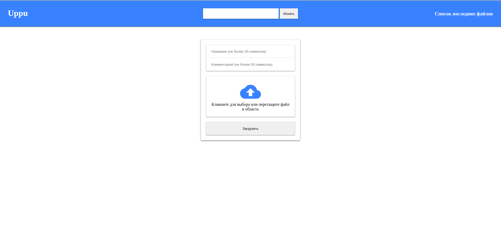
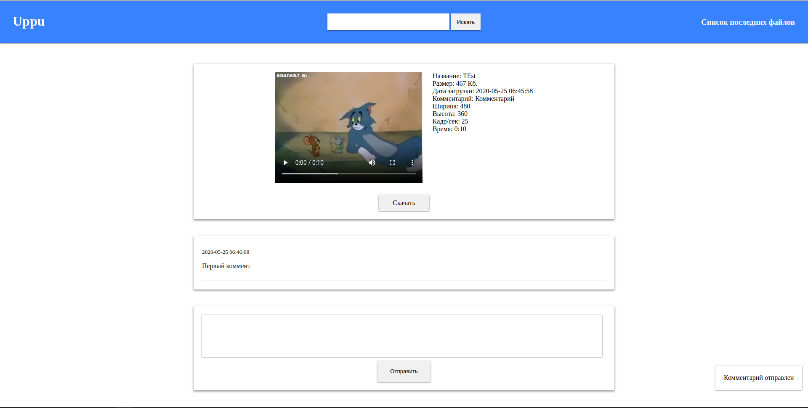
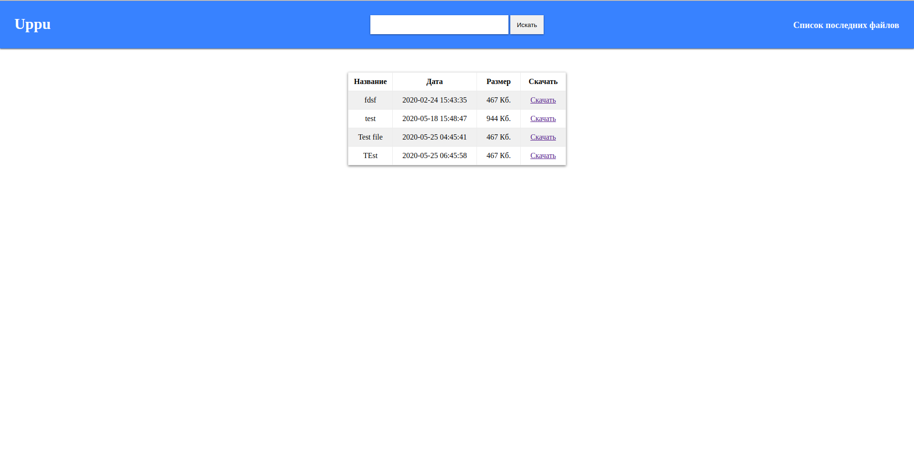

# uppu

## Кратное описание
Файлообменник

##Требования
+ PHP >= 7.1
+ MySQL >= 5.7
+ Apache2.4
+ Composer
+ ffmpeg
+ Gearman

##Порядок установка
1. Поместить на сервер данный репозиторий
2. Переименуйте init.ini.example в init.ini и впишите свои данные
3. Измените корневой каталог проекта на public/
4. Запустите Sphinx
5. Запустите файл gearmanWorker.php

## Скриншоты
### Главная страница

### Страница файла

### Список/поиск
