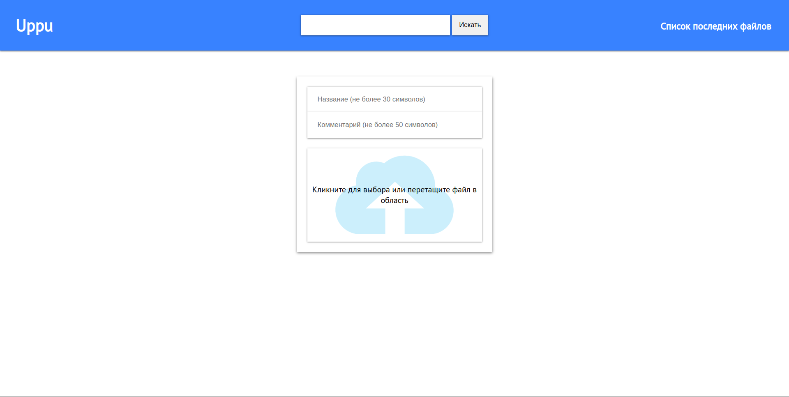
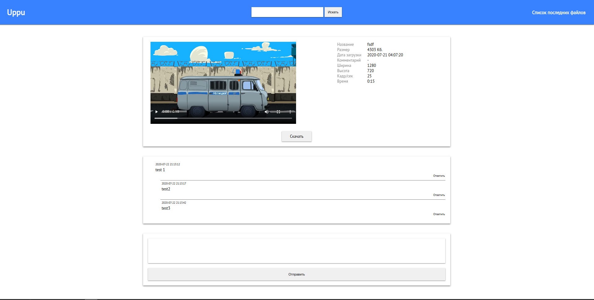
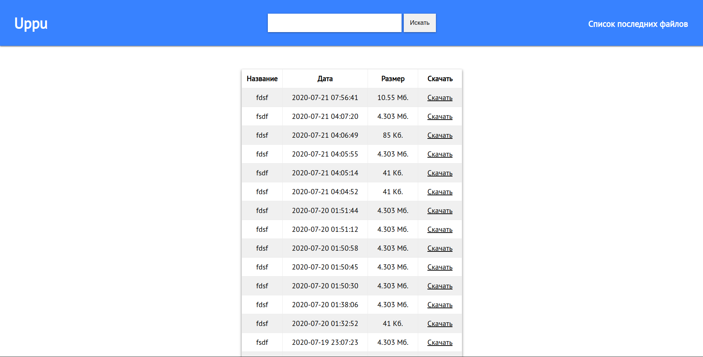

# uppu

## Кратное описание
Файлообменник

## Требования
+ PHP >= 7.1
+ MySQL >= 5.7
+ Apache2.4
+ Composer
+ ffmpeg
+ Gearman
+ tus

## Порядок установка
1. Поместить на сервер данный репозиторий
2. Переименуйте init.ini.example в init.ini и впишите свои данные
3. Измените корневой каталог проекта на public/
4. Создать папку "files" в public
5. Создать в Apache виртуальный хост "tus.com" для папки src
6. Запустите Sphinx
7. Запустите файл gearmanWorker.php
8. Импортируйте uppu.qsl в базу данных MySQL

## Скриншоты
### Главная страница

### Страница файла

### Список/поиск
